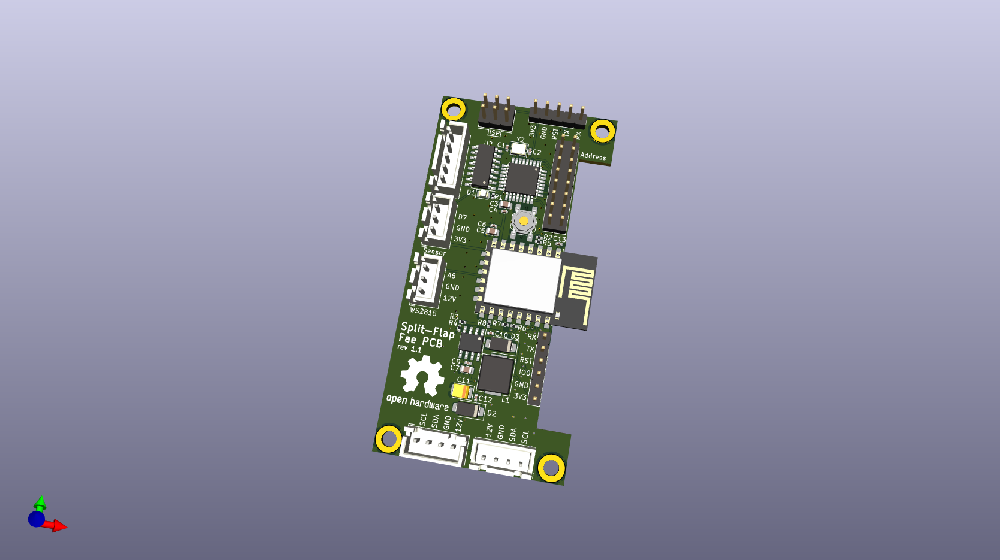

# Split-Flap Fae PCB

This repository contains an alternative, drop-in improved replacement PCB for [David Kingsman's Split-Flap Display](https://github.com/Dave19171/split-flap). 

It provides the following Features:

- Identical PCB outline, connectors and connector positions.
- Removed Arduino Nano, use its Atmega328P directly, saving cost and space.
- Run the Atmega328P on 3V3, removing the need for a 5V rail and logic conversion and increasing power efficiency by using a step-down converter (TPS5430). The entire assembly runs on 3V3 logic now.
- Removed the ESP-12F module and use its ESP8266 chip directly, simplifying the PCB again.
- Added ISP and Serial headers to flash both chips.
- Added more jumpers for address configuration, so displays with more than 16 modules could be built in theory, if the firmware supports it.
- Added an additional connector that could be used to connect WS2815 (12V) LED strip.
- Full compatibility with JLCPCB's SMT assembly service.

## How to order the PCBs:
- Use the gerber files in the `fab` folder for the PCB.
- Use the BOM and top-pos files in the `fab` folder for assembly.
- **Deselect assembly for the ESP2866 module, since you need it on one PCB only. You should solder it on yourself.**
  - To omit the ESP2866 module, deselect U4.
  - To omit the serial pin header for the ESP2866 module, deselect J8.
  - Other parts that are also only needed for the ESP2866 are R5, R6, R7, R8, C5, and C6. However, since these are very tedious to manually solder and having JLCPCB assemble them costs close to nothing, i recommend keeping them in.
